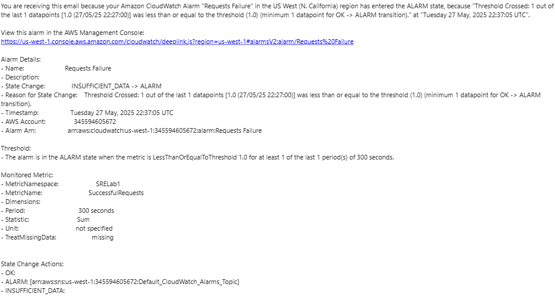

### Lab 1: Implementing Service Level Indicators, Objectives, and Error Budgets

**Objective:**  
Learn to define Service Level Indicators (SLIs), set Service Level Objectives (SLOs), and implement error budgets by creating and monitoring a simple web server on AWS.

**Duration:** ~1 hour  
**Prerequisites:** Basic AWS knowledge (EC2, CloudWatch, IAM), familiarity with SRE concepts.

#### Instructions

1. **Launch an EC2 Instance**
   - In the AWS Management Console, go to **EC2** > **Launch Instance**.
   - Select **Amazon Linux 2 AMI**.
   - Choose `t2.micro` (free-tier eligible).
   - Create a new key pair (e.g., `sre-lab1-key.pem`) and download it.
   - Assign the key file executeble permisioms by running the command:
     ```bash
     chmod 400 sre-lab1-key.pem
     ```
   - Create a security group:
     - Allow **HTTP (port 80)** from `0.0.0.0/0`.
     - Allow **SSH (port 22)** from `0.0.0.0/0`.
   - Launch the instance and note its public IP.

2. **Set Up a Web Server**
   - Connect to the instance via SSH:
     ```bash
     ssh -i sre-lab1-key.pem ec2-user@<public-ip>
     ```
   - Install Apache:
     ```bash
     sudo yum update -y
     sudo yum install -y httpd
     ```
   - Start Apache and enable it on boot:
     ```bash
     sudo systemctl start httpd
     sudo systemctl enable httpd
     ```
   - Create a simple webpage:
     ```bash
     echo "<h1>SRE Lab 1: Web Server</h1>" | sudo tee /var/www/html/index.html
     ```
   - Verify by visiting `http://<public-ip>` in a browser.

**Run in Visual Studio Code Bash terminal** 

3. **Configure CloudWatch Monitoring**
   - Create an IAM Role
    ```bash
      aws iam create-role --role-name EC2MonitoringRole \
      --assume-role-policy-document '{
        "Version": "2012-10-17",
        "Statement": [
          {
            "Effect": "Allow",
            "Principal": {
              "Service": "ec2.amazonaws.com"
            },
            "Action": "sts:AssumeRole"
          }
        ]
      }'
      aws iam create-instance-profile --instance-profile-name EC2MonitoringRole
      aws iam add-role-to-instance-profile \
      --instance-profile-name EC2MonitoringRole \
      --role-name EC2MonitoringRole
    ```
   - Attach policies to the role:
   ```bash
   aws iam attach-role-policy --role-name EC2MonitoringRole \
   --policy-arn arn:aws:iam::aws:policy/AmazonSSMManagedInstanceCore

   aws iam attach-role-policy --role-name EC2MonitoringRole \
   --policy-arn arn:aws:iam::aws:policy/CloudWatchAgentServerPolicy
   ```
   - Associtate the role with the EC2 instance
   ```bash
   aws ec2 associate-iam-instance-profile \
   --instance-id <INSTANCE_ID> \
   --iam-instance-profile Name=EC2MonitoringRole

**Run on EC2 Linux instance**

   ```
   - Install the CloudWatch Agent:
     ```bash
     sudo yum install -y amazon-cloudwatch-agent
     ```
   - Install collectd
     ```bash
     sudo yum install -y collectd
     ```
   - Verify the `types.db` file exists
     ```bash
     ls /usr/share/collectd/types.db
     ```
   - Run the configuration wizard:
     ```bash
     sudo /opt/aws/amazon-cloudwatch-agent/bin/amazon-cloudwatch-agent-config-wizard
     ```
     - For this exercise, select `root` for `run as user`
     - Accept defaults, but monitor `/var/log/httpd/access_log`.
     - Choose `no` when prompted `Do you want to specify any additional log files to monitor?`
     - Choose `no` for `Do you have an existing X-Ray Daemon configuration file to import for migration?`
     - Enter `0` for `Enter a number of the field you would like to update (or 0 to exit)`
     - Select `no` for `Do you want to store the config in the SSM parameter store`
     - /opt/aws/amazon-cloudwatch-agent/bin/config.json
   - Create a new log group
     ```bash
     aws logs create-log-group --log-group-name access_log
     ```
   - Start the agent:
     ```bash
     sudo /opt/aws/amazon-cloudwatch-agent/bin/amazon-cloudwatch-agent-ctl -a fetch-config -m ec2 -c file:/opt/aws/amazon-cloudwatch-agent/bin/config.json -s
     ```

4. **Define SLIs and SLOs**
   - **SLI:** Service Level Indicator is the availability of the web server, measured as the percentage of HTTP 200 responses.
   - **SLO:** Service Level Objective is to achieve 99.9% availability over 30 days, allowing up to 43.2 minutes of downtime.
   - Steps to create a metric filter in CloudWatch:
     1. Navigate to **CloudWatch -> Logs** in the AWS Management Console.
     2. Select **Log groups** and choose the log group associated with your web server.
     3. Click **Create Actions -> Create metric filter** and enter the filter pattern: `"GET / HTTP/1.1" 200`.
     4. Define the metric name as `SuccessfulRequests`, set the namespace to `SRELab1`, and assign a value of 1 for each matching log entry.
     5. Save the filter and verify it is active.

5. **Implement Error Budget**
   - **Error Budget:** The allowable downtime is 0.1% over 30 days, equivalent to 43.2 minutes.
   - Steps to create a CloudWatch alarm:
     1. Navigate to **Alarms** in the AWS Management Console.
     2. Click **Create alarm** and select the metric `SuccessfulRequests` from the namespace `SRELab1`.
     3. Set the statistic to **Sum** and the period to **5 minutes**.
     4. Define the condition: Alarm triggers if the metric falls below a threshold (e.g., 1 request/minute).
     5. Select `Create new topic` for `Send a notification to the following SNS topic`
     6. Enter your email address and give the alarm a name
     7. For simplicity, leave the action field empty (no notifications).
     8. Save the alarm and monitor its status during testing.

6. **Simulate a Failure**
   - Stop the web server:
     ```bash
     sudo systemctl stop httpd
     ```
   - Check CloudWatch after 5-10 minutes to see the metric drop.
   - You should also receive an alert in your email similar to the one below:
   - 

7. **Cleanup**
   - Terminate the EC2 instance via the EC2 console.
   - Delete the CloudWatch alarm.

**Reflection:** How would you adjust the SLO for a critical service?
